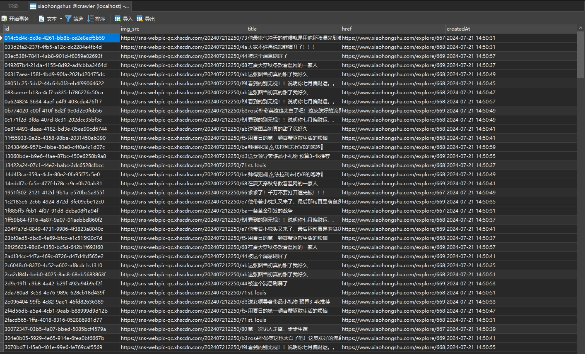

# <p align="center">Get Xiaohongshu notes, BOSS direct recruitment positions, Douyin short videos and other self-media platform data, filter BOSS direct recruitment resumes, and apply for them in one click</p>

[//]: # (https://github.com/ikatyang/emoji-cheat-sheet 表情仓库)

## 🔥 [Chinese Guide](./README.md)

> please visit [Chinese Guide](./README.md)

Disclaimer:

Please use this repository for learning purposes

All content in this repository is for learning and reference only and is prohibited from commercial use. No person or organization may use the content of this repository for illegal purposes or infringe on the legitimate rights and interests of others. The technology involved in this repository is only for learning and research and may not be used to conduct illegal activities on other platforms. This repository does not assume any responsibility for any legal liability arising from the use of the content of this repository. By using the content of this repository, you agree to all the terms and conditions of this disclaimer.


## 🎞️ Project Principle

> By embedding the chroium browser in electron, you can bypass cross-domain restrictions and inject JS scripts \
> Simulate user operations through JS scripts to obtain various data。 \
> Store relevant data through communication between JS script and main process。 \
> By using JS to reverse simulate user operations, there is little obstacle to obtaining data。

Apply for BOSS direct recruitment positions in one click：

The following is the collected note data of Xiaohongshu without any modification：

The following is the video data collected from BOSS Zhipin without any modification：

The following is the video data of Tik Tok collected without any modification：


## 🎨 Running Guide

> The project requires a node environment, node14+ is recommended, the author uses node 18.20.2 \
> Electron has a large dependency, so you need scientific Internet access tools or mirror source configuration. \
> The process communication script that obtains data through webview needs to read the local relative path(file://),Not required with BrowseView

### 1. Install Dependencies

```bash
   npm install
```

### 2. Configuring the database

The configuration file is in `project root directory\src\main\config\config.json`

```json
{
  "development": {
    "username": "root",
    "password": "123456",
    "database": "crawler",
    "host": "127.0.0.1",
    "dialect": "mysql"
  },
  "test": {
    "username": "root",
    "password": null,
    "database": "database_test",
    "host": "127.0.0.1",
    "dialect": "mysql"
  },
  "production": {
    "username": "root",
    "password": "liu435839449",
    "database": "database_production",
    "host": "127.0.0.1",
    "dialect": "mysql"
  }
}
```

### 3. Run the project

```bash
   npm run start:web &  npm run start 
   或者
   npm run startAll
```

### 4. Compile the project
```
1、npm install                             - 安装依赖
2、npm run start:web  & npm run start      - 开发调试
3、npm run build:test:web  & npm run build - 编译测试环境生产
4、npm run build:web  & npm run build      - 编译windows生产
5、npm run build:web  & npm run build:deb  - 编译linux 生产

> Compile through the electron-builder.yml configuration in the root directory
> The compiled output directory is in the release folder under the root directory by default (including installation package, green startup exe file, green package zip file)
```


### 5. Hot Update
```
1、Configure the hot update address of the publish field under electron-builder.yml
2、A new version has been compiled
3、Put the newly compiled exe package and latest.yml in the hot update address to ensure direct access
```

### 6、Project Structure

```
├── crawler-client         # 自媒体采集RPA
├────  build               # web端编译输出静态文件目录
├────  public              # web端挂在根节点目录
├────  release             # 桌面应用编译后输出目录
├────  scripts             # 桌面应用自定义脚本目录（nsi自定义安装）
├── src                    # web前端代码目录
│   ├── main/              # electron主进程
│   │   ├── config/              # 数据库配置
│   │   ├── models/              # 数据库表配置目录
│   │   ├── services/            # sequelize操作sql服务目录
│   │   ├── dbUtils.js/          # db工具函数
│   │   ├── main.js/             # 桌面应用主入口
│   │   ├── preload.js/          # 主进程和渲染进程通信注册文件
│   │   ├── preload2.js/         # 主进程和webview通信注册文件
│   │   ├── processUtils/        # 工具函数
│   ├── renderder/         # electron渲染进程
│   │   ├── entry/               # web端入口目录
│   │   ├── layout/              # web端布局目录
│   │   ├── mock/                # web端初始化数据
│   │   ├── pages/               # web端页面目录
│   │   ├── redux/               # web端状态机目录
│   │   ├── routers/             # web端路由目录
│   │   ├── statics/             # web端静态资源目录
│   │   ├── utils/               # web端工具函数目录
│   ├── scripts/           # webview注入脚本目录
│   ├── static/            # 桌面应用静态资源目录（应用图标之类）
│   ├── utils/             # 工具函数目录
│   └── index.js/          # 空文件（勿删，会报错，craco V7 要求必须要有一个index.js）
├── package.json    
├── env.development        # 开发环境配置
├── env.production         # 生产环境配置
├── env.test               # 测试环境配置
├── .gitignore             # git忽略配置
├── electron-builder.yml   # 应用编译/分发/热更新配置
├── craco.config.js        # webpack配置
└── webstorm.config        # webstorm配置
```

## 💡 Content in development

> Content in development 2024/7/27
>

| 蓝图                         | 完成情况       | 存在问题        |
|----------------------------- |------------|-------------|
| 1、小红书增加采集笔记评论列表      | 已完成     | 暂无  |
| 2、小红书批量关注               | 开发中    | 暂无  |
| 3、抖音增加采集短视频评论列表      | 开发中    | 暂无  |
| 4、抖音批量关注                 | 开发中    | 暂无  |
| 5、流程引擎                    | 开发中    | 暂无  |
| 6、解释器                      | 开发中    | 暂无  |
| 7、执行器                      | 开发中    | 暂无  |
| 8、存储                        | 开发中    | 暂无  |

## 🌟 Star History

<br>

[](https://star-history.com/#liumengniu/crawler-client&Timeline)


